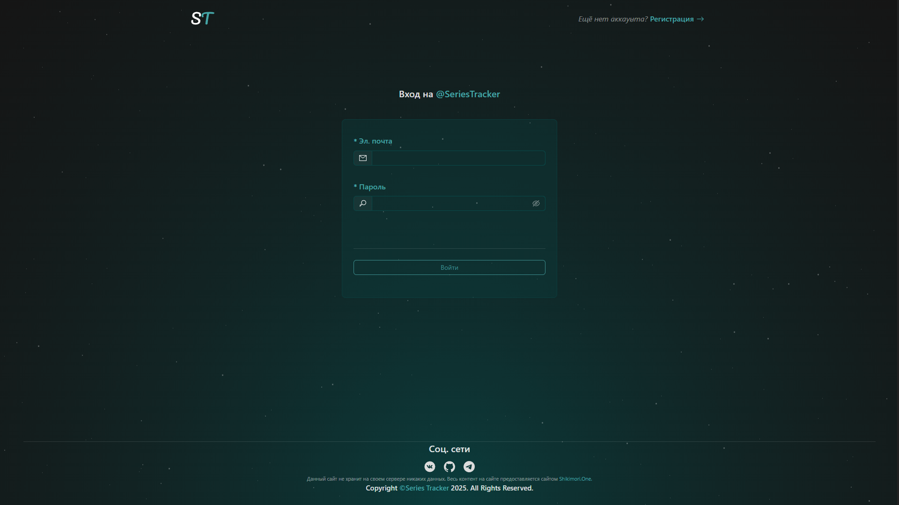
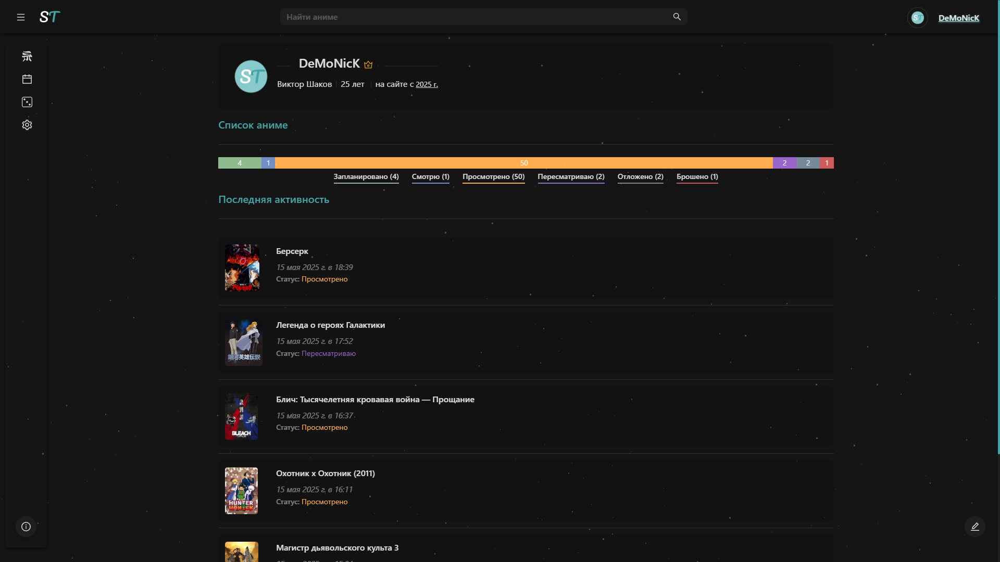

<h1 align="center">
    
     
    <b>Series Tracker.WebApp | Full Stack application for tracking animes</b>
</h1>

    <a href="#зачем">Зачем?</a>
    •
    <a href="#технологии">Технологии</a>
    •
    <a href="#функциональность">Функциональность</a>
    •
    <a href="#скриншоты">Скриншоты</a>
    •
    <a href="#демонстрация">Демонстрация</a>
    •
    <a href="#лицензия">Лицензия</a>

## Зачем?

После работы над .NET MAUI приложениями для мобильных устройств, я решил попробовать себя в Full Stack разработке.  
Этот проект – результат того, что у меня получилось. Он построен с использованием Next.js (React) и ASP.NET Core. 
В целом этот проект стал для меня отличной возможностью изучить React, улучшить навыки работы с .Net, а также получить опыт разработки full stack приложений в целом. 

## Технологии

Этот проект построен с использованием следующих технологий:

*   **Backend:**
    *   Visual Studio - Основной инструмент для работы с кодом.
    *   C# - Язык разработки.
    *   ASP.NET Core -  Платформа для создания веб-API.
    *   PostgreSQL -  Реляционная база данных для хранения данных.
    *   EntityFramework Core - ORM для взаимодействия с БД.
    *   JWT -  Для аутентификации и авторизации.
    *   Shikimori API - Внешний API для получения данных.
    *   Automapper -  Для преобразования данных.
*   **Архитектура:**
    *   Реализована архитектура, основанная на паттерне Репозиторий-Сервис-Контроллер, для разделения ответственности и улучшения масштабируемости:
        *   `.Api`:  Контроллеры API.
        *   `.Application`: Сервисы (бизнес-логика).
        *   `.Core`: Общие модели и интерфейсы.
        *   `.DataAccess`: Репозитории для работы с данными.
        *   `.Infrastructure`: Вспомогательные сервисы и интеграции.
*   **Тестирование:**  Применяются юнит-тесты и интеграционные тесты для обеспечения качества кода.
*   **Frontend:**
    *   Visual Studio Code - Основной инструмент для работы с кодом.
    *   Next.js - Фреймворк для создания пользовательского интерфейса.
    *   TypeScript -  Язык разработки.
    *   CSS -  Для оформления.
    *   Ant Design -  Библиотека UI-компонентов.
    *   Day.js - Библиотека для работы с датами.
    *   SWR - Библиотека для эффективной загрузки данных.
 
## Функциональность

### Общее

*   Современный и интуитивно понятный интерфейс.
*   Адаптивный дизайн для различных устройств.

### Каталог аниме

*   Получение списка аниме из Shikimori API.
*   Расширенная фильтрация списка по различным параметрам.
*   Сортировка списка по популярности, рейтингу и другим критериям.
*   Безопасный поиск.
*   Функция поиска случайного аниме.
*   Календарь выхода аниме на ближайшие 7 дней с фильтрацией по дням недели.

### Личный список аниме

*   Добавление аниме в личный список.
*   Установка параметров для каждого аниме в списке:
    *   Категория просмотра.
    *   Количество просмотренных эпизодов.
    *   Пометка как “избранное”.
*   Удаление аниме из личного списка.
*   Фильтрация личного списка по категориям и избранному.

### Профиль пользователя

*   Просмотр информации о пользователе.
*   Отображение статистики личного списка аниме:
    *   Последние добавленные/измененные аниме.
    *   Общая статистика.
*   Просмотр полного личного списка аниме.
*   Редактирование информации об аккаунте.
*   Удаление аккаунта.
*   Полная очистка личного списка аниме.

## Управление пользователями и контентом (для модераторов и администраторов)

### Модераторы:

*   Просмотр списка пользователей.
*   Просмотр списка категорий.
*   Удаление обычных пользователей.

### Администраторы:

*   Тоже, что и модератор.
*   Удаление любых пользователей (кроме администраторов).
*   Изменение ролей пользователей (на модератора).
*   Изменение цвета категорий аниме.

## Авторизация и аутентификация

*   Регистрация новых пользователей.
*   Вход в существующие аккаунты.
*   Разграничение доступа на основе ролей (пользователь, модератор, администратор).

## Хранение данных

*   Все данные хранятся на сервере PostgreSQL.

## Скриншоты

### Здесь представлены скриншоты того, как приложение выглядит на устройствах с различным размером экрана.

* Desktop версия

    
Нажмите, чтобы посмотреть скриншоты

<table>
    <tr>
        <td width="50%"><b>
Страница входа
</b>
        <td width="50%"><b>
Страница регистрации
</b>
    </tr>
    <tr>
        <td width="50%"><b>
Главная страница приложения
</b>
        <td width="50%"><b>
Окно для параметризированного поиска
</b>
    </tr>
    <tr>
        <td width="50%"><b>
Страница календаря
</b>
        <td width="50%"><b>
Страница профиля пользователя
</b>
    </tr>
    <tr>
        <td width="50%"><b>
Страница пользовательского списка
</b>
        <td width="50%"><b>
Страница редактирования профиля пользователя
</b>
    </tr>
    <tr>
        <td width="50%"><b>
Экран детальной информации об аниме
</b></td>
        <td width="50%"><b>
Страница с правилами
</b></td>
    </tr>
    <tr>
        <td width="50%"><b>
Страница настроек (категории)
</b>
        <td width="50%"><b>
Страница настроек (пользователи)
</b>
    </tr>
</table>

* Мобильная версия

    
Нажмите, чтобы посмотреть скриншоты

    
<table>
    <tr>
        <td width="50%"><b>
Страница входа
</b>
        <td width="50%"><b>
Страница регистрации
</b>
    </tr>
    <tr>
        <td width="50%"><b>
Главная страница приложения
</b>
        <td width="50%"><b>
Окно для параметризированного поиска
</b>
    </tr>
    <tr>
        <td width="50%"><b>
Страница календаря
</b>
        <td width="50%"><b>
Страница профиля пользователя
</b>
    </tr>
    <tr>
        <td width="50%"><b>
Страница пользовательского списка
</b>
        <td width="50%"><b>
Страница редактирования профиля пользователя
</b>
    </tr>
    <tr>
        <td width="50%"><b>
Экран детальной информации об аниме
</b></td>
        <td width="50%"><b>
Страница с правилами
</b></td>
    </tr>
</table>

## Демонстрация
[Посмотреть небольшую видео-демонстрацию приложения](https://drive.google.com/file/d/1HMkyuQreIwc_jnymMmDFiqK_y2c9OFMQ/view?usp=drive_link/preview)

## Лицензия

Series Tracker.WebApp распространяется на условиях лицензии Apache (версия 2.0). Подробности в [Лицензия](LICENSE.txt).
